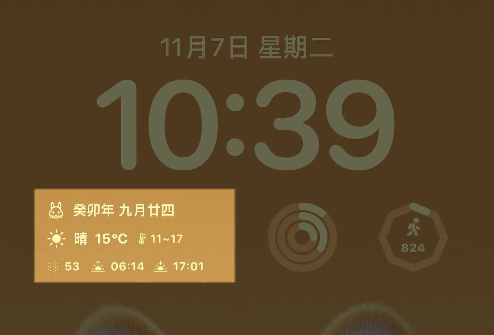

# Scriptable 自用小组件

### 锁屏用的农历和天气小组件

[LockscreenWidget](./LockscreenWidget.js)

- 使用 [calendar.js](https://github.com/jjonline/calendar.js) 获取农历信息
- 显示当前年份的属相emoji 来自 [apple.com](https://www.apple.com.cn/wss/fonts/Apple-Monochrome-Emoji-Ind/v2/SFIndicesAMEmoji_regular.woff2)
- 显示农历日期
- 如果有节气/节假日 则显示节气/节假日
- 从 [彩云天气api](https://caiyunapp.com/api/weather#api) 请求天气数据
- 显示天气状况 图标、文字，当前温度，当日最低温度和最高温度
- 显示当前空气质量、日出日落时间
- 部分方法来自 [Enjoyee/Scriptable](https://github.com/Enjoyee/Scriptable)